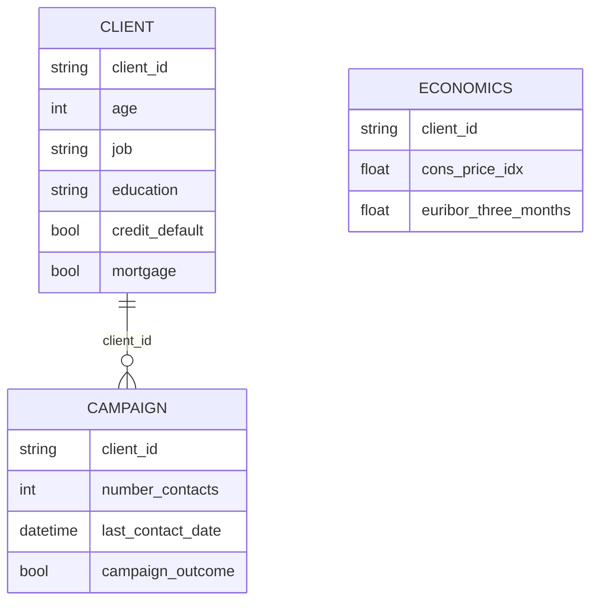

Here’s a professional **README.md** for your Bank Marketing Data Normalization project, designed to showcase your data engineering skills while keeping it accessible and engaging:

---

# **Bank Marketing Data Normalization**  

A **Python data engineering project** that transforms a monolithic bank marketing dataset into normalized tables (3NF) for efficient analysis. Cleans, structures, and exports client, campaign, and economic data into separate CSV files.

## **📌 Project Overview**
This project processes raw bank marketing data ([source](https://archive.ics.uci.edu/ml/datasets/Bank+Marketing)) by:
1. **Splitting** into 3 normalized tables:  
   - `client` (demographics)  
   - `campaign` (marketing interactions)  
   - `economics` (macroeconomic indicators)  
2. **Cleaning** data through:  
   - Boolean encoding (`yes/no` → `True/False`)  
   - Standardizing categorical values (e.g., `job.admin` → `job-admin`)  
   - Handling missing data (`unknown` → `NaN`)  
3. **Transforming** dates (e.g., "may" → "5") into proper datetime format.  

**Use Case**: Enables efficient analysis of client segments, campaign performance, and economic factors.  

---

## **⚙️ Technical Implementation**  

### **🔧 Key Operations**  
1. **Data Normalization**  
   - Separated raw data into 3NF-compliant tables to minimize redundancy.  
2. **Data Cleaning**  
   ```python
   # Example: Boolean conversion
   client_df['mortgage'] = np.where(client_df['mortgage'] == 'yes', '1', '0').astype(bool)
   ```  
3. **Date Parsing**  
   - Mapped month abbreviations (e.g., "jun" → "6") and constructed ISO dates (`2022-06-15`).  

### **📊 Output Schema**  


---

## **🚀 Getting Started**  

### **Prerequisites**  
- Python 3.8+  
- Libraries: `pandas`, `numpy`  

### **Installation**  
```bash
pip install pandas numpy
```

### **Usage**  
1. Place `bank_marketing.csv` in the project directory.  
2. Run the script:  
   ```python
   python bank_data_normalization.py
   ```  
3. Outputs:  
   - `client.csv`  
   - `campaign.csv`  
   - `economics.csv`  

---

## **🛠️ Tech Stack**  
- **Data Processing**: Pandas, NumPy  
- **Normalization**: 3NF compliance  
- **Data Cleaning**: Boolean encoding, categorical standardization, missing data handling  
- **Storage**: CSV (analysis-ready)  

---
